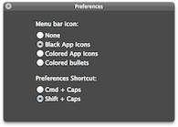
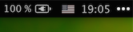
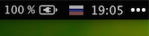
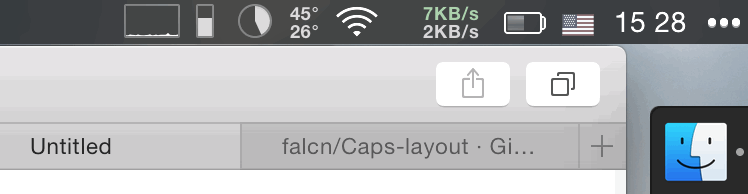

Caps-layout
===========

Переключение между русской и английской раскладками клавишей Caps Lock в OS X системными средствами.

## Установка

[Скачать v1.1](https://github.com/falcn/Caps-layout/releases/download/v1.1/caps-layout.dmg)

* Скопировать `caps-layout.bundle` в `/Library/Keyboard Layouts/`
* Включить раскладку `Caps Layout` в настройках клавиатуры (Russian -> Caps Layout) 

И опционально: 

* Скопировать `Capster.app` и `Caps Lock fix.app` в `/Applications`
* Добавить два вышеуказанных приложения в автозагрузку
* Отключить системный индикатор раскладки

## Содержимое Caps-layout.dmg

* `Lipton_u.bundle` - клавиатурная раскладка для Caps Lock
* `Capster.app` служит заменой системного индикатора раскладки, показывая, какая раскладка активна
* `Caps Lock fix.app` отключает защиту от случайных нажатий для клавиши Caps Lock

## Раскладка

В дополнение к стандартным добавлены украинские буквы

* `alt`-`и` for `і`
* `alt`-`й` for `ї`
* `alt`-`э` for `є`

## Иконки

По-умолчанию `Capster.app` идёт с парой затемнённых иконок российского и американского флагов в наборе _Black App Icons_, которые хорошо смотрятся с 
[Obsidian menu bar](http://www.obsidianmenubar.com) и Dark Mode в OS X Yosemite 

`Shift`+`Caps` - вызвать опции Capster  

  

  

Альтернативные иконки для кириллицы (необходимо заменить `Capster.app/Contents/Resources/capster_mini.png`)

## Прочее

Для защиты от случайных срабатываний кнопки Caps Lock в OS X реализована задержка на переключение режима.
Однако, существует недокументированная возможность(баг?), позволяющая её отключить.
Если в опциях клавиатуры выставить "Caps Lock key" в None, нажать "Ok", после чего снова выставить "Caps Lock key" в "Caps Lock", "Ok", задержка исчезает. Эффект держится до перезагрузки.  
`Caps Lock fix.app` делает это автоматически.

## Ссылки

Сделано на основе раскладки [Lipton](http://azaitsev.com/avt/caps_switch_macos.html)  
*Отличия: убраны growl уведомления, заменены иконки (+retina), добавлена двуязычная кириллическая раскладка.*

Использована иконка и идея из [bandera-layout](https://github.com/muromec/bandera-layout)
